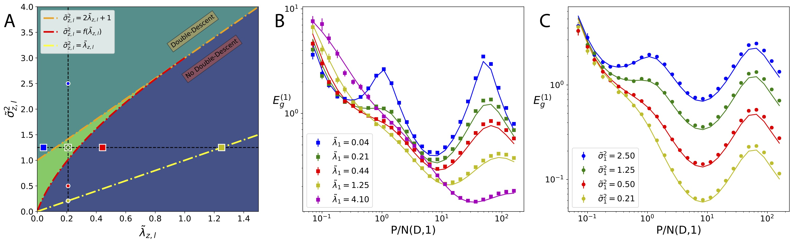

```{r setup, include=FALSE}
knitr::opts_chunk$set(echo = TRUE)
```

## About

I am Blake Bordelon, an applied math PhD student in the [Pehlevan Group](https://pehlevan.seas.harvard.edu/) at Harvard. My research interests lie in the convex hull of machine learning, statistical physics, and theoretical neuroscience. 

## Papers

A. Canatar, B. Bordelon, and C. Pehlevan, [“Statistical Mechanics of Generalization in Kernel Regression,”](https://arxiv.org/abs/2006.13198) 2020. 

B. Bordelon, A. Canatar, and C. Pehlevan, [“Spectrum Dependent Learning Curves in Kernel Regression and Wide Neural Networks,”](https://arxiv.org/abs/2002.02561) International Conference of Machine Learning (ICML), 2020.

M. C. Atkinson, M. H. Mahzoon, M. A. Keim, B. A. Bordelon, C. D. Pruitt, R. J. Charity, and W. H. Dickhoff [“Dispersive optical model analysis of Pb-208 generating a neutron-skin prediction beyond the mean field,”](https://journals.aps.org/prc/abstract/10.1103/PhysRevC.101.044303)
Phys. Rev. C 101, 044303, 2020

B.Bagley, B. Bordelon, B. Moseley, R. Wessel ["Pre-Synaptic Pool Modification (PSPM): A supervised learning procedure for recurrent spiking neural networks""](https://journals.plos.org/plosone/article?id=10.1371/journal.pone.0229083) PLOS ONE 15(2): e0229083, 2020.

### CV
Here is my current [CV](https://blakebordelon.github.io/CV/Blake_CV.pdf)

### Github

My github can be found [here](https://github.com/blakebordelon).





