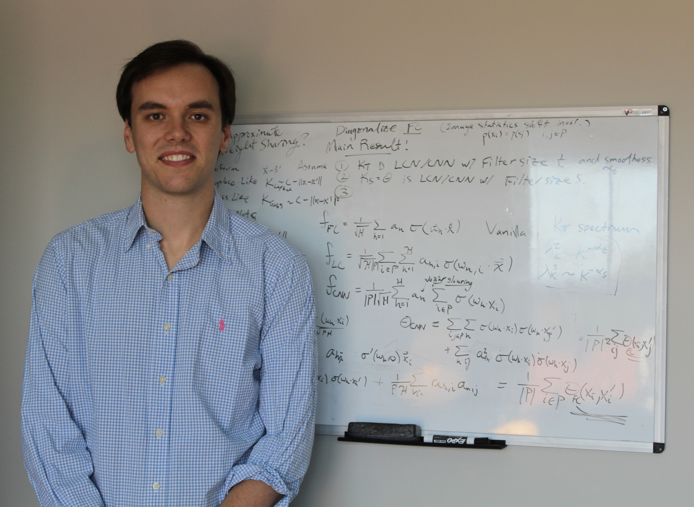

```{r setup, include=FALSE}
knitr::opts_chunk$set(echo = TRUE)
```

## About Me

<div class = "row">
  
<div class = "col-md-4">
<br><br>
{width=100%}
</div>
  
<div class = "col-md-4">
<br><br>
I am Blake Bordelon, an applied math PhD student in the [Pehlevan Group](https://pehlevan.seas.harvard.edu/) at Harvard. My research interests lie in the convex hull of machine learning, statistical physics, and theoretical neuroscience.
</div>
 


