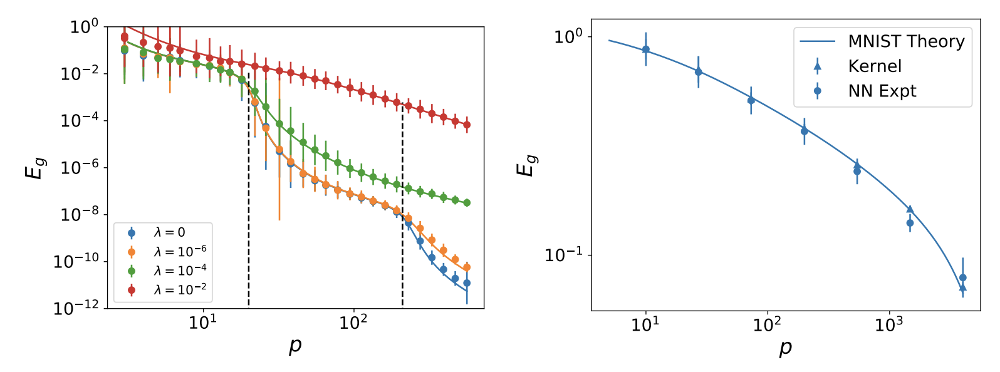
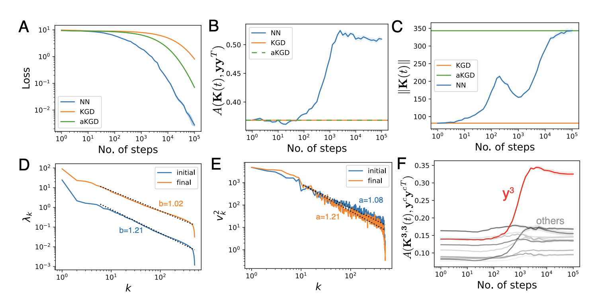
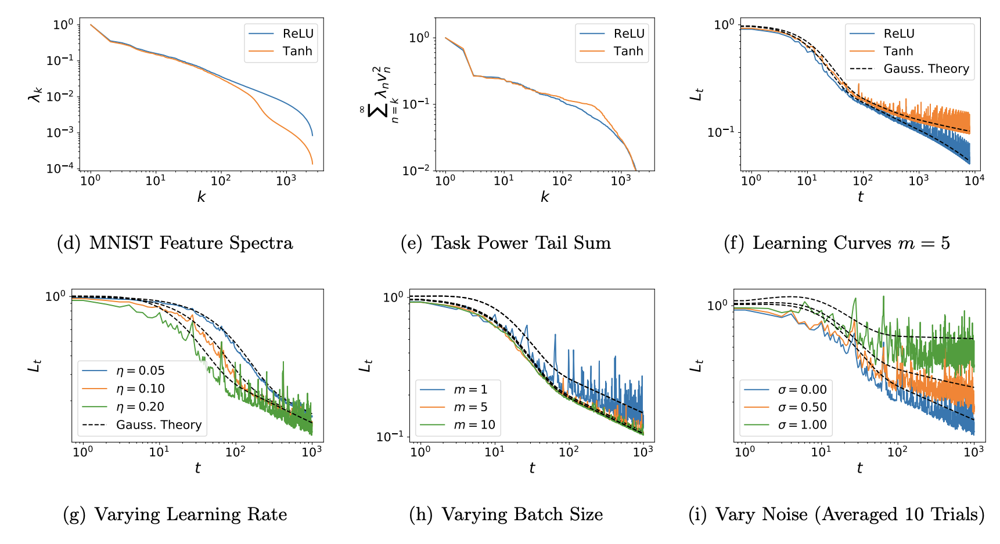
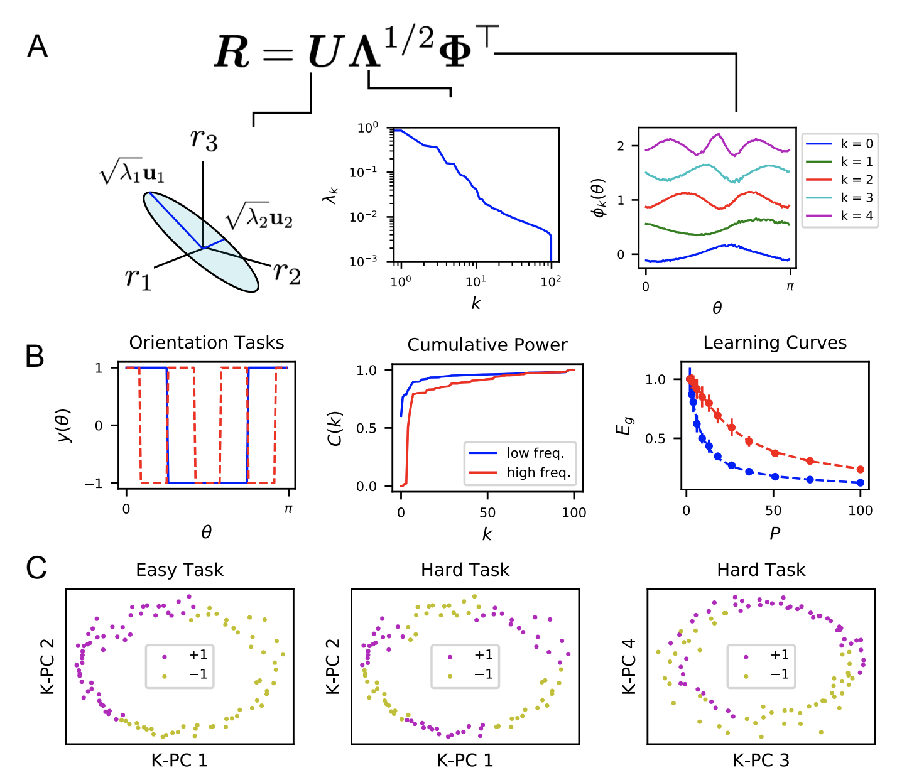

# Machine Learning Theory 

### Generalization of Kernel Regression and Wide Networks

Attempting to gain analytical understanding of the inductive biases of neural networks and how their generalization performance varies with training sample size, I tried studying neural networks in the limit where they behave as linear functions of their parameters (NTK regime). Working with Abdul Canatar and Cengiz Pehlevan, we used the replica method from statistical physics to calculate expected test error for kernel regression models. We showed that the resulting theory accurately predicts learning curves for wide neural networks in the kernel regime. By solving a data-distribution dependent kernel eigenvalue problem, we showed that kernel eigenfunctions with large eigenvalues are estimated most rapidly as sample size increases. This theory provided a notion of inductive bias for kernel regression, defining what kinds of tasks can be learned most quickly for a given kernel and data distribution.

{width=80%}

### Out of Distribution Test Error

More recently, we showed our theory can be used to calculate what happens to the test risk under distribution shift, when test and training distributions do not match. The theory relies heavily on an overlap matrix which measures overlaps of train-distribution eigenfunctions over the test measure. Using our theory, we developed an algorithm to optimize the training measure for a fixed learning problem to get a lower expected test error. We find that the optimal training measure is often different than the test measure. We also used gradient descent on our theoretical expressions to identify beneficial and adversarial test measures for a fixed training distribution. We show that our theory accurately captures generalization under distribution shift for kernel methods and wide neural networks.

### Feature Learning and its Impact on Training Speed

Haozhe Shan and I studied both experimentally and with toy models, how the parameter dependent neural tangent kernel aligns with the training data during optimization. Of particular interest was how the evolution of features influenced the loss dynamics. Experiments showed that the kernel becomes aligned with the outer product of labels, though not perfectly. We developed a toy model where features evolve to minimize the predicted loss in the next time step. In this model, the features and the errors evolve in a coupled elliptical system. The theory reproduces the experimental finding of an additive update to the kernel which is the outer product of labels. 

{width=80%}

### Test Error Dynamics during SGD on Structured Feature Maps
I recently analyzed the expected test loss of SGD by averaging over the history of samples for linear readouts from structured feature maps. The test error can be closed in terms of second and fourth moments of the features and, under certain conditions, the test error predicted by Gaussian features with structured correlations accurately predicts the test loss. We show that errors for different eigenmodes are in general coupled but decouple when learning rate is small and batch size is large. I used the theory to extract test loss scalings of wide conv nets and wide MLPs and show that the theory can predict the better power law exponent for conv-nets on CIFAR-10. The theory also shows that there can be an optimal batch size to minimize expected test error if the compute budget is fixed.

{width=75%}

# Neuroscience

### How the Structure of Neural Codes Alters Inductive Bias

I am also interested in using learning theory ideas such as sample efficiency to help understand some neuroscience recordings. We use our theory of generalization to study what kinds of associations are easy or hard for visual cortex to learn from a limited number of examples. We also apply our model to predict learning curves for readouts from RNNs.

{width=65%}

